# Jujube-SpotSolution-CV - 红枣黑斑点的智能化识别与分拣

## 项目简介

本项目开发了一套红枣黑斑点智能化识别与分拣系统，通过集成高分辨率摄像头与高性能单片机，运用深度学习算法YOLOv8（后更新为YOLOv11，因为学校比赛更在意新不新，不看怎么调）对红枣表面进行实时图像采集与分析，准确识别并分类带有黑斑点的红枣。系统自动化程度高，大幅提高分拣效率和准确性，减少人工成本，保证红枣品质。项目还包括跨平台的APP-GUI界面，提升用户交互体验，实现智能化控制。

该项目针对新疆红枣产业中黑斑病识别与分拣的难题，提供了一种高效、自动化的解决方案。它不仅提升了红枣加工的效率和产品品质，还推动了农业现代化，响应了国家对食品安全和农业科技创新的号召。通过智能化技术的应用，项目有助于提升农业产业的国际竞争力，促进地区经济发展，为农业种植户增加收入，具有显著的社会和经济价值。（吹的我自己都不敢看，我滴妈阿😅，不是为了创新学分也不至于这么扯犊子）

## 项目背景

本项目是一个**大学生创新训练计划项目**，同时也是**大二学期Python课程设计项目**。

- **开发时间**: 2023年第12周
- **项目性质**: 简单的创新训练计划项目
- **技术栈**: Python, PySide6, YOLOv11, MicroPython, ESP32

## 系统架构

### 整体架构

本系统采用**上位机-下位机**分布式架构设计：

```
┌─────────────────────────────────────────────────────────────┐
│                        上位机系统                            │
│  ┌─────────────────┐  ┌─────────────────┐  ┌─────────────────┐ │
│  │   主程序模块     │  │   摄像头线程     │  │   命令控制线程   │ │
│  │   (main.py)    │  │ (Cam_thread.py) │  │ (Cmd_thread.py) │ │
│  │                │  │                │  │                │ │
│  │ - PySide6 GUI  │  │ - YOLO识别      │  │ - 设备控制      │ │
│  │ - 用户交互     │  │ - 图像处理      │  │ - TCP通信       │ │
│  │ - 参数配置     │  │ - 计数统计      │  │ - 分拣触发      │ │
│  └─────────────────┘  └─────────────────┘  └─────────────────┘ │
└─────────────────────────────────────────────────────────────┘
                              │ TCP通信
                              ▼
┌─────────────────────────────────────────────────────────────┐
│                        下位机系统                            │
│  ┌─────────────────┐  ┌─────────────────┐  ┌─────────────────┐ │
│  │   摄像头模块     │  │   命令执行模块   │  │   硬件控制模块   │ │
│  │(main_cam_s3_new)│  │                │  │                │ │
│  │                │  │ - 接收控制指令   │  │ - LED控制       │ │
│  │ - 图像采集      │  │ - 执行分拣动作   │  │ - 传送带控制     │ │
│  │ - 实时传输      │  │ - 状态反馈      │  │ - 电磁铁控制     │ │
│  │ - WiFi通信      │  │                │  │                │ │
│  └─────────────────┘  └─────────────────┘  └─────────────────┘ │
│                     ESP32 + MicroPython                      │
└─────────────────────────────────────────────────────────────┘
```

### 核心模块说明

#### 上位机系统 (PC端)

1. **主程序模块** (`main.py`)
   - 基于PySide6框架的桌面应用程序
   - 提供用户友好的GUI界面
   - 负责整体程序的启动和管理

2. **摄像头线程** (`Cam_thread.py`)
   - 接收ESP32摄像头传输的实时图像数据
   - 使用YOLOv11深度学习模型进行红枣黑斑点识别
   - 实现目标检测、计数统计和分拣触发
   - 支持CPU/GPU推理切换

3. **命令控制线程** (`Cmd_thread.py`)
   - 与下位机ESP32建立TCP通信连接
   - 发送设备控制指令（LED、传送带、分拣器）
   - 处理分拣触发信号

#### 下位机系统 (ESP32端)

1. **摄像头模块** (`iot_device/main_cam_s3_new.py`)
   - 使用MicroPython编程
   - 实现WiFi连接和图像采集
   - 支持多WiFi配置和自动切换
   - 实时向上位机传输图像数据

2. **命令执行模块** (`iot_device/main_cmd.py`)
   - 接收上位机控制指令
   - 控制硬件设备执行分拣动作
   - 管理LED照明、传送带运行、电磁铁分拣

## 主要功能特性

### 🔍 智能识别
- **YOLOv11算法**: 高精度红枣黑斑点检测
- **实时处理**: 支持实时图像流处理
- **多类别识别**: 区分好枣和坏枣
- **参数可调**: IOU、置信度、检测线位置等参数可调节

### 🤖 自动分拣
- **智能触发**: 检测到坏枣自动触发分拣动作
- **精确控制**: 电磁铁精确控制分拣时机
- **计数统计**: 实时统计好枣和坏枣数量
- **多种模式**: 支持IN、OUT、BOTH计数模式

### 📱 用户界面
- **现代化GUI**: 基于PySide6的美观界面
- **实时显示**: 实时显示检测结果和统计信息
- **参数调节**: 可视化参数调节界面
- **状态监控**: 设备连接状态实时监控

### 🌐 网络通信
- **TCP通信**: 稳定的上下位机通信
- **WiFi连接**: 支持多WiFi配置和自动切换
- **断线重连**: 自动重连机制保证系统稳定性

## 技术栈

### 上位机技术
- **Python 3.x**: 主要编程语言
- **PySide6**: GUI框架
- **OpenCV**: 图像处理
- **PyTorch**: 深度学习框架
- **Ultralytics YOLOv11**: 目标检测模型
- **NumPy**: 数值计算
- **PIL**: 图像处理库

### 下位机技术
- **MicroPython**: ESP32编程语言
- **ESP32-CAM**: 摄像头模块
- **WiFi**: 无线通信
- **TCP Socket**: 网络通信协议

## 安装与使用

### 环境要求

#### 上位机要求
- Python 3.8+
- Windows/Linux/macOS
- 至少4GB RAM
- 支持CUDA的GPU（可选，用于加速推理）

#### 下位机要求
- ESP32-CAM开发板
- MicroPython固件
- WiFi网络环境

### 安装步骤

#### 1. 克隆项目
```bash
git clone https://github.com/your-username/Jujube-SpotSolution-CV.git
cd Jujube-SpotSolution-CV
```

#### 2. 安装Python依赖
```bash
pip install -r requirements.txt
```

#### 3. 下载YOLO模型
确保 `models/best.pt` 文件存在，这是训练好的红枣检测模型。

#### 4. 配置ESP32
1. 将MicroPython固件烧录到ESP32-CAM
2. 上传 `iot_device/` 目录下的代码到ESP32
3. 修改WiFi配置信息

### 使用方法

#### 1. 启动上位机程序
```bash
python main.py
```

#### 2. 配置网络参数
- 在GUI界面中配置摄像头IP和端口
- 配置命令控制IP和端口
- 确保与ESP32网络配置一致

#### 3. 启动下位机
- 给ESP32-CAM上电
- 等待WiFi连接成功
- 观察上位机连接状态

#### 4. 开始检测
- 点击开始检测按钮
- 调节检测参数（IOU、置信度等）
- 观察实时检测结果
- 查看分拣统计数据

## 配置说明

### 网络配置

#### 主要WiFi配置
```python
MAIN_SSID = 'HUAWEI_IOT_node'  # 主要WiFi名称
MAIN_PASSWORD = '111gogogo'     # 主要WiFi密码
MAIN_SERVER_IP = '192.168.8.8'  # 主要服务器IP
MAIN_SERVER_PORT = 53002        # 主要服务器端口
```

#### 备用WiFi配置
系统支持多个备用WiFi配置，当主WiFi不可用时自动切换。

### 检测参数
- **IOU阈值**: 0.1-0.9，控制重叠检测框的过滤
- **置信度阈值**: 0.1-0.9，控制检测结果的可信度
- **检测线位置**: 0.1-0.9，控制计数线的水平位置
- **线条宽度**: 1-5，控制检测框和计数线的显示宽度

## 项目结构

```
jujube_blackpatch_v2/
├── main.py                 # 主程序入口
├── Cam_thread.py          # 摄像头处理线程
├── Cmd_thread.py          # 命令控制线程
├── Refine_window.py       # 窗口界面定义
├── Ui_jujube.py          # UI界面文件
├── Global_info.py        # 全局信息管理
├── Hardware_info.py      # 硬件信息
├── requirements.txt      # Python依赖
├── models/
│   └── best.pt           # YOLO检测模型
├── iot_device/
│   ├── main_cam_s3_new.py # ESP32摄像头程序
│   └── main_cmd.py       # ESP32命令控制程序
├── images/               # 图标和图片资源
└── README.md            # 项目说明文档
```

## 应用程序界面展示

### 主界面展示

<div align="center">

#### 主界面
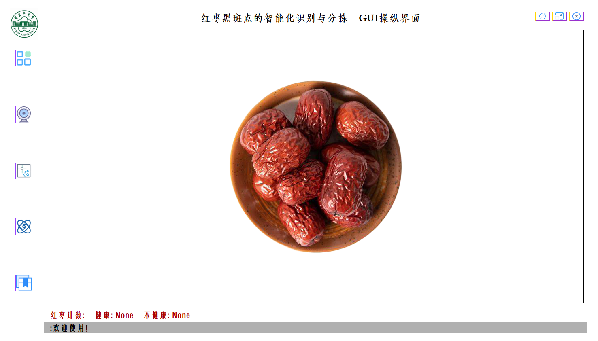
*系统主界面，展示了简洁现代的用户界面设计*

#### 主界面-菜单展开
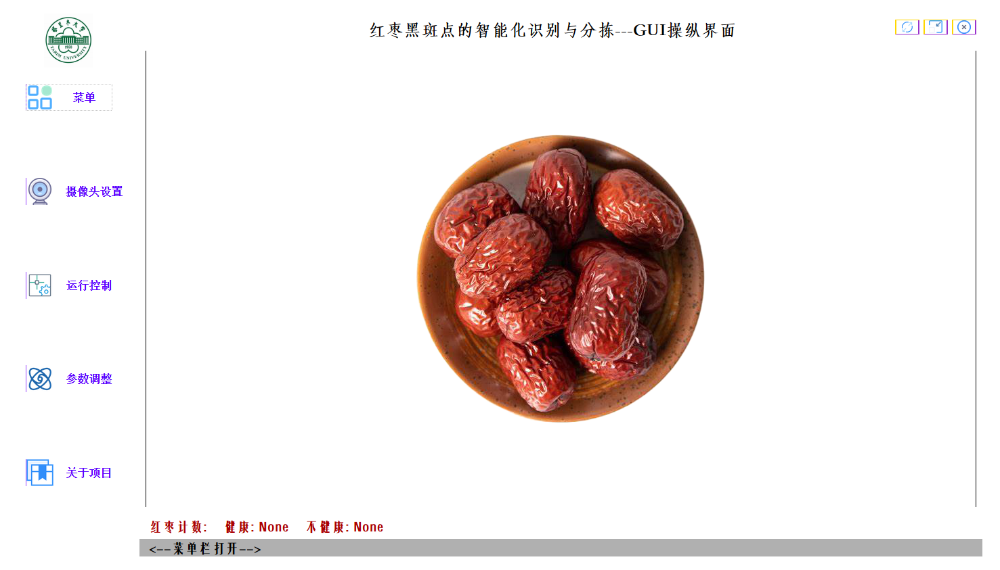
*展开菜单后的主界面，显示了完整的功能导航*

#### 主菜单-全展开
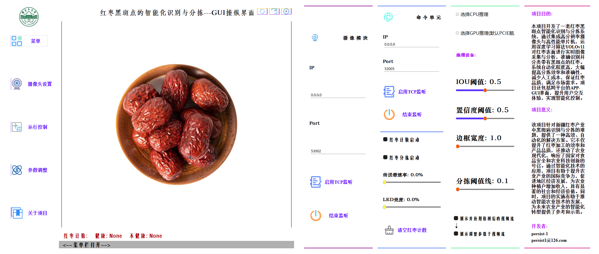
*完全展开的菜单界面，展示了系统的所有功能模块*

</div>

### 功能模块界面

<div align="center">

<table>
<tr>
<td align="center">

#### 摄像头模块
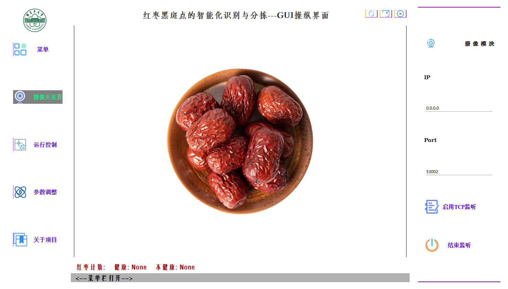
*摄像头控制界面，用于配置图像采集参数*

</td>
<td align="center">

#### 参数调整模块
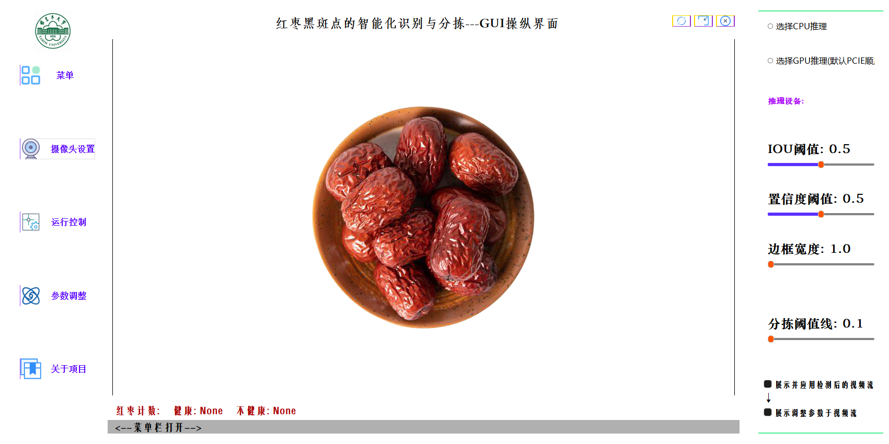
*参数调整界面，可调节YOLO检测参数*

</td>
</tr>
<tr>
<td align="center">

#### 命令控制模块
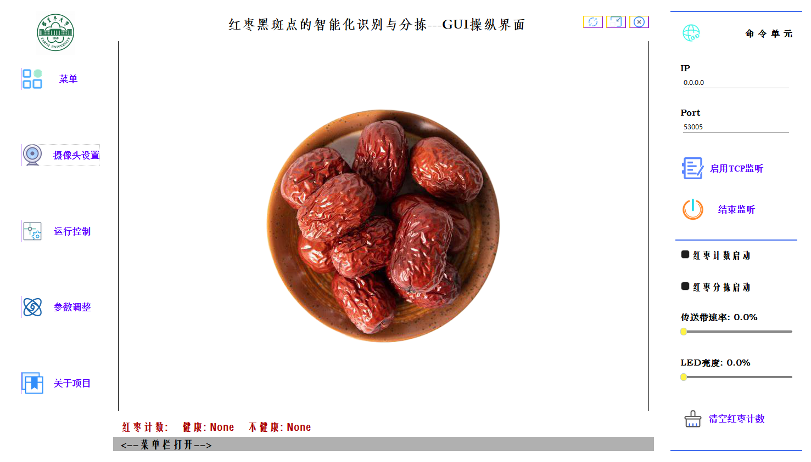
*命令控制界面，用于设备控制和通信设置*

</td>
<td align="center">

#### 项目介绍模块
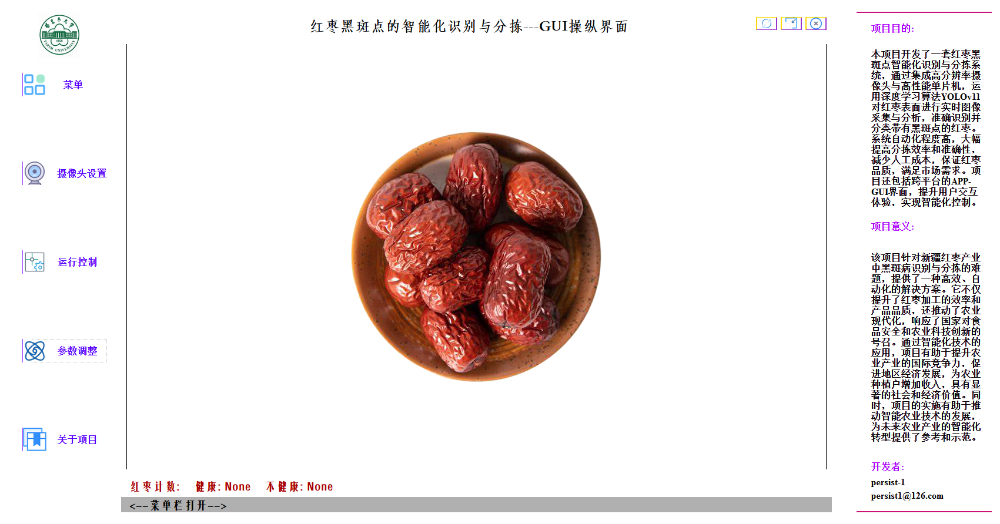
*项目介绍界面，展示项目信息和团队成员*

</td>
</tr>
</table>

</div>

### 检测效果展示

<div align="center">

<table>
<tr>
<td align="center">

#### 检测效果1
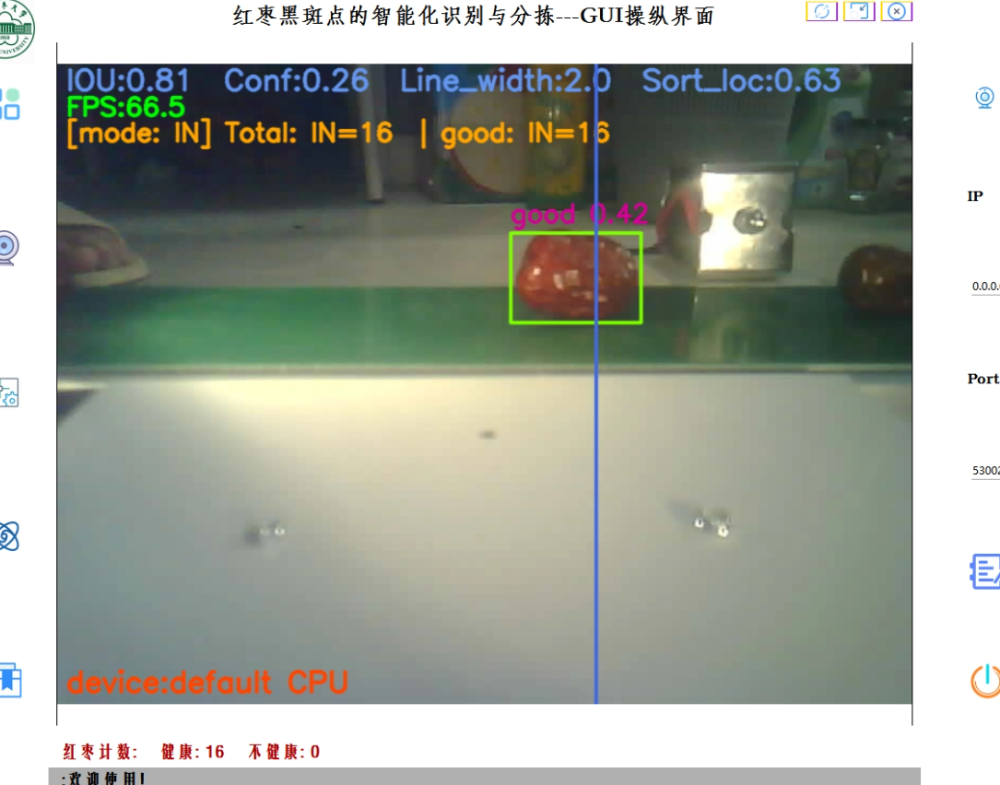
*红枣检测效果展示，成功识别好枣和坏枣*

</td>
<td align="center">

#### 检测效果2
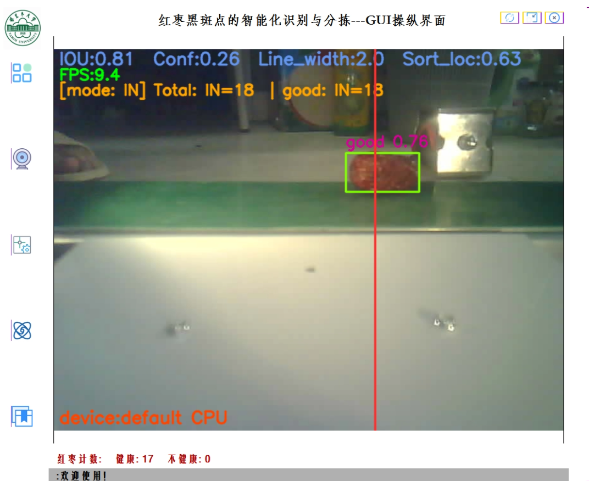
*多目标检测效果，实时显示检测框和置信度*

</td>
</tr>
<tr>
<td align="center">

#### 检测效果3
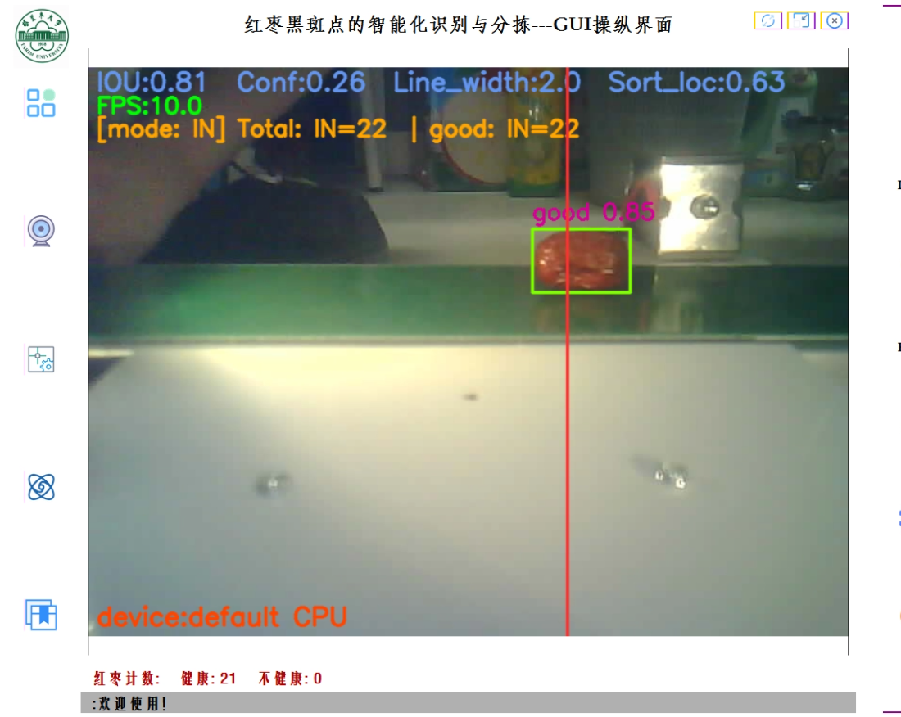
*检测线功能展示，用于触发分拣动作*

</td>
<td align="center">

#### 分拣实现效果
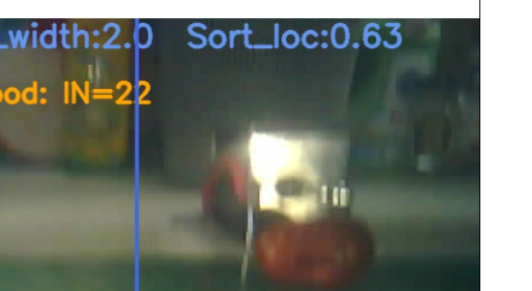
*电磁铁分拣机制实际工作效果*

</td>
</tr>
</table>

</div>

### 功能特点说明

- **🎯 精准检测**: 基于YOLOv11的高精度红枣黑斑点识别
- **⚡ 实时处理**: 支持实时图像流处理和分析
- **🎛️ 参数可调**: 支持IOU、置信度、检测线位置等参数实时调节
- **📊 统计功能**: 实时统计好枣和坏枣数量，支持多种计数模式
- **🔧 硬件控制**: 集成LED照明、传送带控制、电磁铁分拣等硬件控制功能
- **📱 现代界面**: 基于PySide6的现代化GUI设计，用户体验友好

### 软件著作权证书

<div align="center">


*红枣黑斑病害识别系统V1.0软件著作权证书*
*由于大创结项需要申请软著，折腾了很久才搞出来，中间因为各种原因补正（总之以后申请就有经验了😫）*

</div>

## 开发团队

本项目由愚蠢的大学生开发，作为创新训练计划项目和Python课程设计项目。
项目作者: persist-1<<persist1@126.com>>

## 许可证

本项目采用 MIT 许可证，详见 LICENSE 文件。

## 致谢

感谢所有为本项目提供支持和帮助的老师和同学们，这个项目的桌面端开发周期并不长，但数据采集、数据标注、模型训练却是用了数月之久，所以本项目最大的感悟是应该购买或直接下飞桨、kaggle上的开源数据集，毕竟这项目就没什么产出，没必要这么折腾自己🤗

---

## 其它

本项目参照了YOLOSHOW、YOLOSIDE、PYDracula等项目，感谢这些项目的作者。

由于我水平较差，很多代码与复用模块存在耦合度较高的问题（简称shi山代码），而且很多部分由于在当时学习PyQT/Pyside开发时，对于信号与槽的通信理念并不够充分了解，导致仍存在部分模块间使用全局变量通信...在测试中虽然不会过于影响性能，但这仍然是一个心病。

由于云服务到期时没有备份gitea仓库，导致代码丢失，所以将这些课设小项目代码存到github上；该项目后续没有更新的计划。

数据集未开源，仅提供已经训练好的模型（./models/best.pt）。